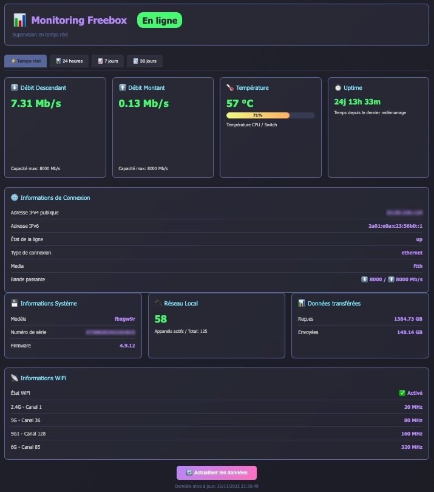

# 📡 Freebox Monitor

Tableau de bord moderne et complet pour le monitoring de votre Freebox en temps réel avec historique sur 30 jours.


## ✨ Fonctionnalités

### 📊 Monitoring en temps réel
- **Débits** : Graphiques en temps réel du débit descendant et montant
- **Température** : Surveillance de la température moyenne (CPU + HDD)
- **Uptime** : Temps de fonctionnement depuis le dernier redémarrage
- **Appareils connectés** : Nombre d'appareils actifs sur le réseau

### 📈 Historique long terme
- **24 heures** : Moyennes calculées toutes les 5 minutes
- **7 jours** : Moyennes calculées par heure
- **30 jours** : Moyennes calculées toutes les 4 heures
- **Stockage SQLite** : Base de données persistante avec nettoyage automatique

### 📡 Informations WiFi
- État du WiFi (activé/désactivé)
- Liste complète des Access Points actifs
- Canal et largeur de bande pour chaque AP (2.4G, 5G, 5G1, 6G)

### 🌐 Informations réseau
- Adresses IPv4 et IPv6 publiques
- Type de connexion et média (FTTH, Ethernet, etc.)
- Bande passante disponible
- Données transférées (réception/émission)

### 🎨 Interface utilisateur
- **Thème Dracula** : Interface sombre et moderne
- **Mode plein écran** : Touche `F` pour basculer
- **Actualisation automatique** : Toutes les 5 secondes
- **Responsive** : Compatible mobile, tablette et desktop



## 🐳 Installation avec Docker

### Prérequis
- Docker et Docker Compose installés
- Une Freebox (testée sur Freebox Ultra/Pop avec Freebox OS 4.9+)
- Accès physique à la Freebox pour l'autorisation initiale

### Installation rapide

1. **Cloner le repository**
```bash
git clone https://github.com/votre-username/freebox-monitor.git
cd freebox-monitor
```

2. **Configurer et lancer**
```bash
chmod +x start.sh
./start.sh
```

Ou manuellement :
```bash
docker compose build
docker compose up -d
```

3. **Autoriser l'application**

Au premier lancement, vous verrez dans les logs :
```
🔐 AUTORISATION REQUISE - Appuyez sur le bouton ► de votre Freebox Server
```

Vous avez **2 minutes** pour :
- Vous rendre sur votre Freebox Server
- Appuyer sur le bouton ► (flèche droite) pour autoriser l'application

4. **Accéder à l'interface**

Ouvrez votre navigateur : `http://VOTRE_IP:5000`

Le token d'authentification sera automatiquement sauvegardé dans `/app/data/freebox_token.json`

## 📋 Configuration

### docker-compose.yml

```yaml
services:
  freebox-monitor:
    build: .
    container_name: freebox-monitor
    restart: unless-stopped
    network_mode: host
    volumes:
      - ./data:/app/data
    healthcheck:
      test: ["CMD", "curl", "-f", "http://localhost:5000/api/info"]
      interval: 30s
      timeout: 10s
      retries: 3
```

### Variables d'environnement

Vous pouvez personnaliser le port en modifiant le fichier Python :
```python
FREEBOX_URL = "http://mafreebox.freebox.fr"
PORT = 5000
```

## 📊 API Endpoints

### Temps réel
- `GET /` - Interface web
- `GET /api/status` - Données complètes en JSON
- `GET /api/info` - Informations sur l'API

### Historique
- `GET /api/history/24h` - Données des 24 dernières heures
- `GET /api/history/7d` - Données des 7 derniers jours
- `GET /api/history/30d` - Données des 30 derniers jours

### Exemple de réponse API
```json
{
  "success": true,
  "timestamp": 1764519961.5421176,
  "system": {
    "temp_avg": 58,
    "uptime_val": 2105721,
    "firmware_version": "4.9.12"
  },
  "connection": {
    "ipv4": "12.34.56.78",
    "rate_down": 76245,
    "rate_up": 25148
  },
  "stats": {
    "rx_bytes": 1462876017279,
    "tx_bytes": 157645916439
  }
}
```

## 🎯 Utilisation

### Raccourcis clavier
- **F** : Basculer en mode plein écran
- **Échap** : Quitter le plein écran

### Onglets de navigation
- **⚡ Temps réel** : Vue en direct avec rafraîchissement automatique
- **📊 24 heures** : Graphique d'historique sur 24h
- **📈 7 jours** : Graphique d'historique sur 7j
- **📉 30 jours** : Graphique d'historique sur 30j

## 🔧 Développement

### Structure du projet
```
freebox-monitor/
├── Dockerfile
├── docker-compose.yml
├── freebox_monitor_standalone.py  # Application Flask complète
├── requirements.txt
├── start.sh
├── .dockerignore
├── README.md
└── data/
    ├── freebox_token.json          # Token d'authentification (auto-généré)
    └── freebox_history.db          # Base de données SQLite (auto-créée)
```

### Technologies utilisées
- **Backend** : Python 3.11, Flask, Flask-CORS
- **Base de données** : SQLite3
- **Frontend** : HTML5, CSS3, JavaScript (Canvas API)
- **API Freebox** : v8 (HMAC-SHA1)

### Construire depuis les sources
```bash
# Cloner le projet
git clone https://github.com/votre-username/freebox-monitor.git
cd freebox-monitor

# Construire l'image Docker
docker build -t freebox-monitor .

# Lancer le conteneur
docker run -d \
  --name freebox-monitor \
  --network host \
  -v $(pwd)/data:/app/data \
  freebox-monitor
```

## 🐛 Dépannage

### L'interface ne charge pas
```bash
# Vérifier les logs
docker compose logs -f

# Redémarrer le conteneur
docker compose restart
```

### Erreur d'autorisation
```bash
# Réinitialiser le token
rm data/freebox_token.json
docker compose restart

# Appuyer sur ► sur la Freebox dans les 2 minutes
```

### Pas de données d'historique
L'historique se remplit automatiquement. Attendez :
- **5 minutes** : Premières données visibles
- **1 heure** : Graphique 24h commence à se former
- **1 jour** : Graphique 7j commence à se former

### Vérifier la connexion à l'API
```bash
curl http://localhost:5000/api/info
```

## 📝 Notes importantes

### Compatibilité
- ✅ Freebox Ultra (Freebox OS 4.9+)
- ✅ Freebox Pop (Freebox OS 4.8+)
- ✅ Freebox Delta (Freebox OS 4.2+)
- ⚠️ Modèles plus anciens : Fonctionnalités limitées (pas de WiFi 6G)

### Sécurité
- Le token est stocké localement dans `/app/data/freebox_token.json`
- Accès en lecture seule à l'API Freebox
- Aucune modification possible sur la Freebox via cette application

### Performance
- **Stockage** : ~1 MB par jour d'historique
- **Mémoire** : ~50 MB de RAM
- **CPU** : Négligeable (<1%)

## 🤝 Contribution

Les contributions sont les bienvenues ! N'hésitez pas à :
1. Fork le projet
2. Créer une branche (`git checkout -b feature/amelioration`)
3. Commit vos changements (`git commit -am 'Ajout fonctionnalité'`)
4. Push vers la branche (`git push origin feature/amelioration`)
5. Ouvrir une Pull Request

## 📜 Licence

Ce projet est sous licence MIT. Voir le fichier `LICENSE` pour plus de détails.

## 🙏 Remerciements

- [Freebox OS API Documentation](http://dev.freebox.fr/sdk/os/)
- [Flask](https://flask.palletsprojects.com/)
- [Dracula Theme](https://draculatheme.com/)

## 📧 Support

Pour toute question ou problème :
- Ouvrir une [issue](https://github.com/votre-username/freebox-monitor/issues)
- Consulter la [documentation de l'API Freebox](http://dev.freebox.fr/sdk/os/)

---

⭐ **N'oubliez pas de mettre une étoile si ce projet vous est utile !**
